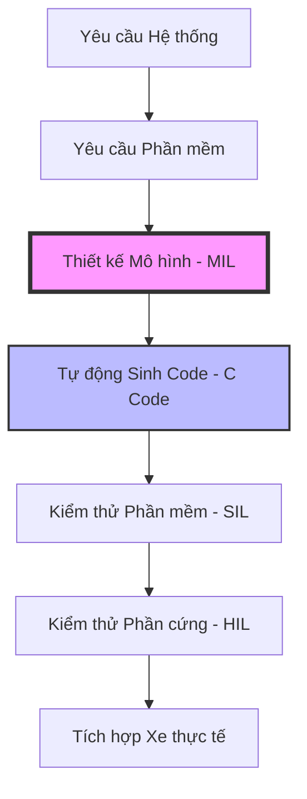
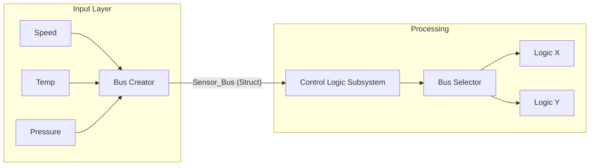
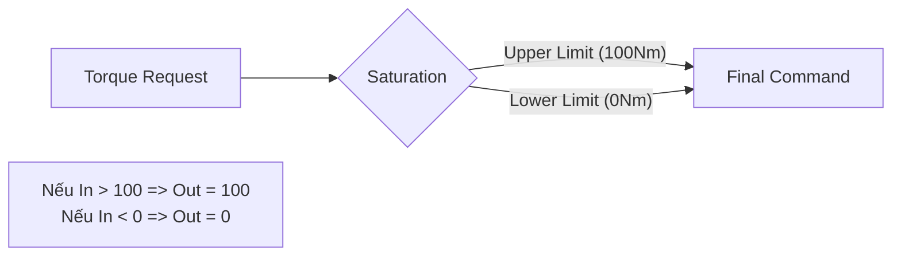
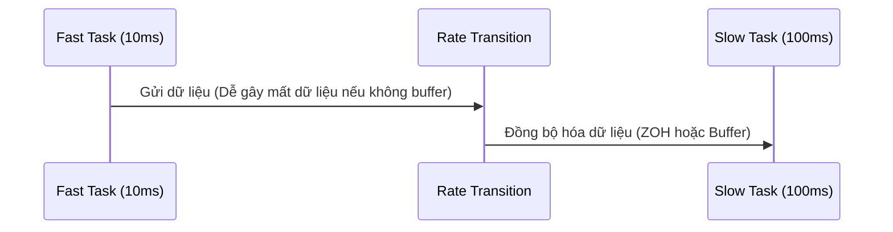
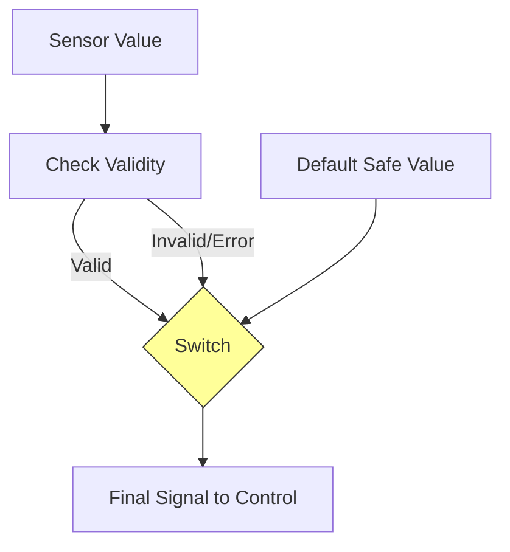

# Tài liệu Kỹ thuật: Quy trình & Kỹ thuật MBD chuyên sâu

## 1. Chu trình V-Model trong MBD Automotive
Đây là xương sống của mọi dự án ECU (Engine Control Unit). Quy trình này đảm bảo tính đúng đắn từ yêu cầu đến khi ra sản phẩm thực tế.

## 2. Quản lý Tín hiệu & Bus (Signal Management)
Trong các hệ thống phức tạp, việc sử dụng dây nối (wire) đơn lẻ sẽ làm mô hình bị rối ("Spaghetti model"). Sử dụng **Bus** là bắt buộc để quản lý hàng trăm tín hiệu sensor.

### Minh họa cấu trúc Bus:
*   **Bus Creator:** Gói các tín hiệu đơn lẻ (Speed, Temp, Pressure) thành một Struct.
*   **Bus Selector:** Trích xuất đúng tín hiệu cần thiết tại Subsystem đích.

## 3. Logic Điều khiển Phổ biến: Switch & Saturation
Đây là hai kỹ thuật quan trọng nhất để bảo vệ hệ thống và chuyển đổi chế độ.

### Cấu trúc bảo vệ Actuator (Saturation):
Mọi lệnh điều khiển (Torque, Voltage) trước khi gửi ra ngoài phải đi qua block Saturation để tránh làm hỏng phần cứng.

## 4. Xử lý Đa luồng (Multirate) & Rate Transition
ECU thường chạy nhiều tác vụ với tốc độ khác nhau (ví dụ: Đọc sensor 10ms, Tính toán nhiệt độ 100ms).

| Thành phần | Đặc điểm | Lưu ý (MAB Guidelines) |
| :--- | :--- | :--- |
| **Fast Task (10ms)** | Xử lý các tín hiệu nhanh như dòng điện, vị trí motor. | Phải dùng **Rate Transition** block khi gửi dữ liệu sang task chậm. |
| **Slow Task (100ms)** | Xử lý nhiệt độ, trạng thái pin, chẩn đoán. | Tránh để logic nặng ở task nhanh để tiết kiệm CPU. |

### Minh họa Rate Transition:

## 5. Ví dụ: Thiết kế Logic "Limp Home Mode"
Khi sensor hỏng, hệ thống phải chuyển sang giá trị an toàn (Default value).

*   **Block sử dụng:** `Relational Operator` (kiểm tra lỗi), `Switch` (chọn giá trị).

