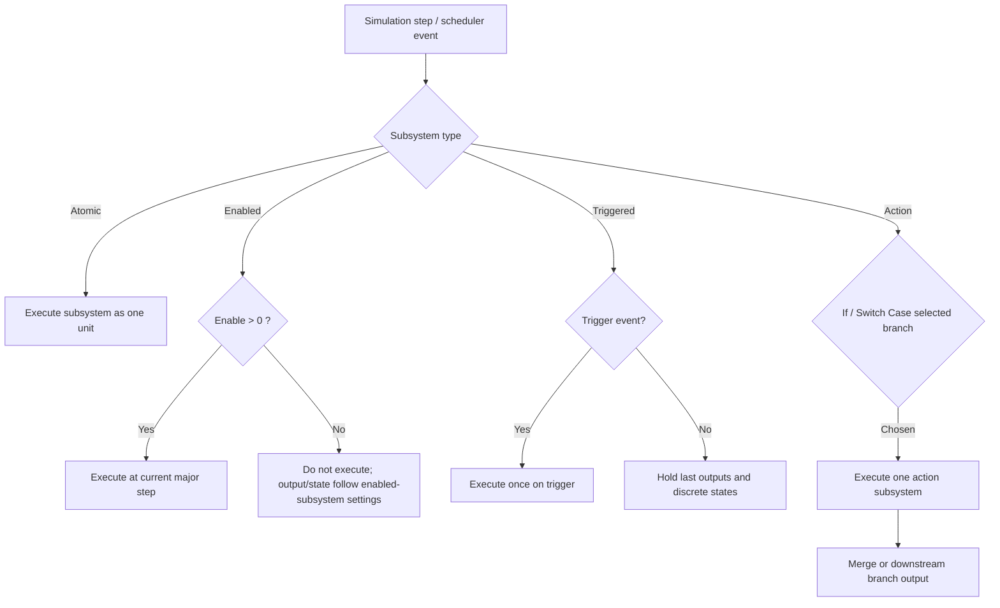
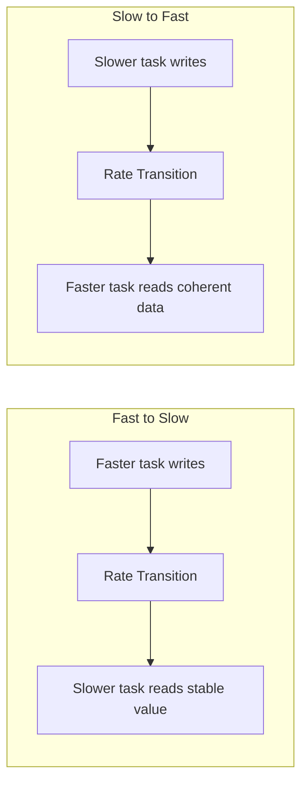

# Nghiên cứu sâu về nền tảng Simulink và phong cách mô hình hóa theo

## Tóm tắt điều hành

Báo cáo này ưu tiên tuyệt đối tài liệu chính thức trên `mathworks.cn`, sau khi đã kiểm tra connector đang bật là Google Drive. Trong Google Drive, có hai tài liệu liên quan xuất hiện rõ nhất là `Using Simulink and Stateflow in Automotive Applications.pdf` và `mab-guidelines-v6.pdf`; tuy nhiên, để bám đúng ràng buộc nguồn, phần phân tích và khuyến nghị học tập bên dưới được neo chủ yếu vào các trang chính thức của `mathworks.cn`, còn tài liệu trong Drive chỉ được ghi nhận như nguồn đối chiếu ban đầu. fileciteturn2file0L1-L1 fileciteturn3file0L1-L1

Nếu phải rút gọn thành một kết luận học tập duy nhất, thì thứ tự hiệu quả nhất là: **hiểu ngữ nghĩa thực thi của subsystem** → **nắm bus và signal metadata** → **làm chủ multirate với Rate Transition** → **chuẩn hóa bằng MAB/Model Advisor** → **sau đó mới học variants và callbacks**. Lý do là tài liệu chính thức của Simulink mô tả subsystem, signal propagation, buses, sample times, Model Advisor, variants, và callbacks như một chuỗi phụ thuộc logic: thực thi mô hình và thuộc tính tín hiệu cần rõ trước khi kiểm tra style, biến thể, hay tự động hóa vòng đời model. citeturn15view1turn15view2turn15view5turn23view3turn15view0turn16view3turn15view8turn16view0

Với người học chưa nêu rõ trình độ, tôi khuyến nghị hai lộ trình song song. **Nhánh beginner** đi theo chiều rộng trước, khoảng 6 tuần và khoảng 40–50 giờ ở mức thực hành vừa phải; **nhánh intermediate** nén còn 4 tuần, tập trung vào tái cấu trúc model, signal metadata, rate transitions, MAB checks, và capstone tích hợp. Các ví dụ practice nên ưu tiên model/example chính thức như `ex_alternately_executing_model`, `sldemo_counters`, `ex_if_block`, `ex_switch_case_block`, `BusHierarchy`, `BusOutput`, `ex_units_fuelsys`, và `sldemo_variant_initFcn`. citeturn1search0turn1search5turn18view12turn19view0turn25view1turn3search9turn16view2

Một điểm quan trọng về thuật ngữ: trên `mathworks.cn`, bộ quy tắc hiện hành được trình bày dưới tên **MAB Modeling Guidelines**; mục tiêu cốt lõi của bộ quy tắc này là **readability**, **simulation and verification**, và **code generation**, còn việc kiểm tra tuân thủ được gắn trực tiếp với **Model Advisor** thông qua các check và check IDs cụ thể. citeturn14view0turn11search5turn14view1turn15view0

## Phạm vi, giả định và nguồn

Bạn chưa nêu rõ **trình độ hiện tại**, **miền ứng dụng mục tiêu** (ô tô, điều khiển công nghiệp, robot, embedded Coder, v.v.), hay **mục tiêu cuối** là mô phỏng, code generation, hay review style. Vì vậy, báo cáo này tách rõ: một đường học cho beginner và một đường học cho intermediate; đồng thời các ví dụ được chọn theo hướng **Simulink nền tảng, không khóa vào một domain hẹp**. Khi có ví dụ gần automotive hoặc control system trong tài liệu chính thức, tôi ưu tiên chúng vì chúng phản ánh các mẫu mô hình hóa điển hình của Simulink. citeturn20view0turn21view0turn11search2

Phần nguồn chính của báo cáo gồm bốn cụm. Cụm thứ nhất là **MAB/Model Advisor**: mục tiêu guideline, danh mục guideline, danh sách MAB checks, và cách chạy Model Advisor. Cụm thứ hai là **execution semantics**: conditional subsystems, sample times, atomic behavior, enabled/triggered/action subsystems. Cụm thứ ba là **interfaces và data semantics**: bus objects, Bus Creator/Selector, signal propagation, `Simulink.Signal`, `Signal Specification`, range, units. Cụm cuối là **advanced architecture**: `Rate Transition`, `Variant Subsystem`, variant control modes, activation times, cùng callback basics (`PreLoadFcn`, `InitFcn`, `ModelCloseFcn`). citeturn14view0turn14view1turn15view0turn15view1turn15view2turn15view4turn15view5turn15view6turn15view7turn15view8turn15view9

## Bản đồ kiến thức theo từ khóa

### Simulink modeling guidelines theo MAB

Tài liệu MAB trên `mathworks.cn` định vị guideline như một hệ quy tắc để người tạo model và người tiêu thụ model có cùng cách hiểu; ba trục mục tiêu là **khả đọc**, **mô phỏng/kiểm chứng**, và **sinh mã**. Đây không chỉ là “quy tắc trình bày đẹp”, mà là nền để giảm lỗi kết nối, hỗ trợ testability, và tăng tính ổn định của generated code. citeturn14view0turn11search5

| Thành phần học | Nội dung nên nắm | Mục tiêu học | Tiên quyết | Thời lượng L/M/H | Thứ tự khuyến nghị |
|---|---|---|---|---|---|
| Mục tiêu và cấu trúc guideline | Ý nghĩa của readability, simulation/verification, code generation; các nhóm Naming, Simulink, Stateflow, MATLAB | Hiểu MAB là khung review kỹ thuật, không phải chỉ là style “thẩm mỹ” | Biết mở model, đọc signal/block/subsystem | 2h / 5h / 8h | Sau khi đã biết thao tác Simulink cơ bản |
| Mapping guideline → check | Cách một rule được map sang check name và check ID; rule nào checkable / not checkable | Biết review theo checklist có thể lặp lại | Cơ bản về Simulink Check và Model Advisor | 1h / 2h / 4h | Học song song với Model Advisor |
| Nhóm rule trọng yếu cho người mới | signal line connections, Inport/Outport usage, signal labels, font/layout, sample time, type setting by data objects, conditional subsystem output init, default/else case, Merge block, trigger signal names | Chuyển từ “model chạy được” sang “model review được” | Đã học subsystem, signal, rate | 2h / 4h / 6h | Sau khi học subsystem và signals |

**Bài thực hành đề nghị**

1. Tạo một model nhỏ cố ý có lỗi style: một vài line chưa đặt tên, một `If` không có `else/default`, một conditional subsystem không cấu hình initial output rõ ràng, và một số tên block/signal không nhất quán.  
2. Mở **Model Advisor** và chạy thư mục **MAB Checks**.  
3. Ghi lại các check ID thất bại, đặc biệt là `jc_0640`, `jc_0641`, `jc_0644`, `jc_0656`, `jc_0659`, `jc_0281`, cùng các check naming/connections cơ bản.  
4. Sửa model và chạy lại cho đến khi report còn ít warning có chủ đích.  
5. Xuất report HTML và giữ làm “chuẩn baseline” cho các bài capstone sau. citeturn14view1turn27view0turn28view0turn15view0turn12search0turn12search6

### Subsystem types: Atomic, Enabled, Triggered, Action

Đây là cụm kiến thức nền quan trọng nhất, vì Simulink định nghĩa sự khác nhau giữa các subsystem theo **ngữ nghĩa thực thi**, không chỉ theo “hình dáng block”. Tài liệu chính thức nêu rằng conditional subsystems là nonvirtual; triggered subsystem là một **conditionally executed atomic subsystem**; action subsystems được điều khiển bởi `If` hoặc `Switch Case`; còn atomic subsystem là cơ chế gom các block thành **một đơn vị thực thi duy nhất**. citeturn15view1turn21view0turn3search6turn22view3

| Thành phần học | Nội dung nên nắm | Mục tiêu học | Tiên quyết | Thời lượng L/M/H | Thứ tự khuyến nghị |
|---|---|---|---|---|---|
| Virtual vs Atomic | atomic execution, `Treat as atomic unit`, execution order, tác động tới modularity/codegen | Phân biệt hierarchy đồ họa và boundary thực thi | Rất cơ bản về Subsystem | 2h / 4h / 6h | Đầu tiên |
| Enabled Subsystem | enable > 0, enable crossing, trạng thái/output khi disable, use case cho discontinuities | Dùng đúng khi thực thi phụ thuộc logic gating | Sample time cơ bản | 2h / 4h / 6h | Đầu tiên |
| Triggered Subsystem | rising/falling/either trigger, outputs hold between triggers, discrete states hold, block restrictions | Dùng đúng cho event-driven logic / interrupt-like behavior | Sample time, trigger basics | 2h / 4h / 6h | Đầu tiên |
| Action Subsystem | If Action, Switch Case Action, top-down evaluation, implied break, Merge usage | Dùng đúng cho mutually exclusive branch execution | If/Switch Case block basics | 2h / 4h / 6h | Ngay sau Enabled/Triggered |

**Bài thực hành đề nghị**

1. Mở `ex_alternately_executing_model` để quan sát hai enabled subsystems hoạt động luân phiên trong ví dụ chỉnh lưu toàn sóng.  
2. Mở `sldemo_counters` để thấy enabled/triggered subsystems trong ngữ cảnh đếm sự kiện tràn.  
3. Mở `ex_if_block` và `ex_switch_case_block`, sau đó quan sát hành vi của `Merge` khi chỉ một action subsystem được chọn ở mỗi bước.  
4. Tự tạo một subsystem thường, bật **Treat as atomic unit**, hiển thị execution order, rồi so sánh block order bên trong và bên ngoài subsystem.  
5. Với một triggered subsystem, thử các kiểu trigger `rising`, `falling`, `either`, rồi kiểm tra việc output giữ giá trị trước đó giữa các lần trigger. citeturn20view0turn21view0turn18view12turn19view0turn22view3turn15view2

### Bus Object, Bus Creator, Bus Selector

Trong docs của Simulink, `Bus Creator` mặc định tạo **virtual bus**; `Simulink.Bus` tạo ra một **đặc tả dùng lại được** cho bus và các element; và bus object là **tùy chọn cho virtual buses nhưng bắt buộc cho nonvirtual buses**. Với code generation, nonvirtual bus được định nghĩa bởi bus object sẽ ánh xạ sang cấu trúc trong generated code. Ở interface của subsystem/model, MathWorks còn khuyến nghị dùng **Out Bus Element** thay vì ghép `Bus Creator + Outport`, vì cách đó giảm rối line và dễ thay đổi interface dần dần. citeturn23view2turn23view4turn18view8turn25view1

| Thành phần học | Nội dung nên nắm | Mục tiêu học | Tiên quyết | Thời lượng L/M/H | Thứ tự khuyến nghị |
|---|---|---|---|---|---|
| Bus Creator/Selector | virtual bus, nested bus, select by name, direct feedthrough của Bus Selector | Dùng bus để giảm rối model mà không mất traceability | Biết signal naming | 2h / 4h / 6h | Sau subsystem |
| Bus Objects | `Simulink.Bus`, `Simulink.BusElement`, nonvirtual bus, storage/loading, mapping to model | Khóa interface bằng schema rõ ràng | Hiểu virtual bus | 2h / 5h / 7h | Sau Bus Creator |
| Tạo/sinh bus object | Type Editor, Model Explorer, `Simulink.Bus.createObject` từ Bus Creator hoặc bus element ports | Tăng tốc chuẩn hóa interface | MATLAB cơ bản | 1h / 3h / 4h | Sau khi hiểu bus object |

**Bài thực hành đề nghị**

1. Mở model `BusHierarchy`; dựng lại bus hai tầng bằng `Bus Creator`; đặt tên element rõ ràng.  
2. Từ `BusHierarchy/Bus Creator1`, chạy quy trình theo docs để tạo `Simulink.Bus` bằng `Simulink.Bus.createObject`; kiểm tra `TopBus` và `NestedBus` trong Type Editor.  
3. Chuyển top bus sang nonvirtual và quan sát phần khác biệt về interface/code traceability.  
4. Dùng `Bus Selector` để chọn ra hai nhánh con theo tên.  
5. Tạo một `BusElement` có `DataType`, `Min`, `Max`, `Unit`, rồi nối lại vào `Signal Specification` để kiểm chứng sự ưu tiên metadata từ bus object. citeturn25view1turn24view3turn18view8turn18view9turn23view3

### Signal properties: data type, min/max, unit

Signal trong Simulink có các thuộc tính quan trọng như **data type**, **units**, **sample time**, **Min/Max**, dimensions, v.v., và các thuộc tính này được **propagate** dọc theo signal lines trong giai đoạn model compilation. `Simulink.Signal` cho phép gán hoặc xác thực thuộc tính theo instance; `Signal Specification` cho phép ép hoặc xác nhận các thuộc tính tín hiệu; còn units có vai trò nhất quán hóa tích hợp giữa các component. Min/Max không chỉ phục vụ kiểm tra range, mà còn liên quan đến autoscaling cho fixed-point. citeturn15view5turn17view0turn18view0turn18view1turn18view5

| Thành phần học | Nội dung nên nắm | Mục tiêu học | Tiên quyết | Thời lượng L/M/H | Thứ tự khuyến nghị |
|---|---|---|---|---|---|
| Signal propagation | nguồn gán thuộc tính, inherited vs explicit, block-port consistency | Hiểu tại sao một mô hình “chạy” nhưng vẫn có metadata yếu | Bus basics | 1h / 2h / 3h | Sau buses |
| Data type | built-in, fixed-point, enum, `Bus:`, `ValueType:` | Kiểm soát chính xác kiểu tín hiệu | MATLAB data types cơ bản | 1h / 2h / 4h | Sau propagation |
| Min/Max | simulation range checking, autoscaling | Dùng range như ràng buộc kỹ thuật chứ không chỉ ghi chú | Data type | 1h / 2h / 3h | Sau data type |
| Unit | units ở boundary, unit consistency, unit mismatch troubleshooting | Tránh mismatch khi tích hợp thành phần | Signal basics | 1h / 2h / 3h | Sau Min/Max |
| Bus element metadata | `Simulink.BusElement` cho data type, min/max, unit | Đưa metadata xuống interface mức element | Bus objects | 1h / 2h / 3h | Sau Unit |

**Bài thực hành đề nghị**

1. Mở `ex_units_fuelsys`; thêm units theo đúng workflow tăng dần như docs mô tả.  
2. Chọn một signal và tạo `Simulink.Signal` object; đặt `DataType`, `Min`, `Max`, `Unit`.  
3. Chèn `Signal Specification` lên đường tín hiệu đó và thử ép một data type khác để quan sát cảnh báo/xung đột metadata.  
4. Bật **Simulation range checking** rồi tạo một test signal vi phạm Min/Max.  
5. Nếu đã có bus object, chuyển đơn vị của một bus element để thấy block-level `Min/Max/Unit` có thể bị bỏ qua và lấy theo metadata của `BusElement`. citeturn3search9turn17view0turn18view1turn18view2turn24view3turn17view2

### Rate Transition block

Trong multirate models, tài liệu chính thức mô tả hai tình huống định kỳ chính: **fast-to-slow** và **slow-to-fast**. `Rate Transition` là block chuyên dụng để bảo vệ truyền dữ liệu giữa các task/rate khác nhau; nó cho phép đánh đổi giữa **data integrity**, **deterministic transfer**, **latency**, và **memory use**. Simulink còn có thể tự động chèn hidden `Rate Transition` blocks nếu bật cấu hình **Automatically handle rate transition for data transfer**. citeturn26view3turn16view4turn26view0

| Thành phần học | Nội dung nên nắm | Mục tiêu học | Tiên quyết | Thời lượng L/M/H | Thứ tự khuyến nghị |
|---|---|---|---|---|---|
| Fast-to-slow / slow-to-fast | vấn đề lịch thực thi, preemption, hold/delay semantics | Hiểu tại sao multirate model dễ sai dù “trông hợp lý” | Sample time basics | 1h / 2h / 3h | Sau signal metadata |
| Integrity vs determinism | buffer strategy, latency, labels `ZOH`, `1/z`, `Buf`, `Db_buf`, `3buf` | Chọn mode phù hợp mục tiêu runtime | Multitasking basics | 1h / 2h / 3h | Sau cơ chế cơ bản |
| Auto insertion | hidden RT blocks, badges, convert hidden → visible | Dùng tool đúng thay vì chèn tay mọi nơi | Model configuration basics | 1h / 2h / 2h | Sau mode |
| Codegen cautions | asynchronous assumptions, single reader/writer, không đặt RT trong triggered hierarchy | Tránh pattern gây hiểu sai/bug runtime | C/C++ codegen basics | 1h / 2h / 3h | Sau khi dùng được block |

**Bài thực hành đề nghị**

1. Tạo một model gồm hai nguồn periodic có sample times khác nhau và một block tiêu thụ chung.  
2. Bật **Automatically handle rate transition for data transfer**, update diagram, sau đó quan sát badge `ZOH` và `DbBuf`.  
3. Chuyển hidden RT thành visible block, rồi so sánh các mode bật/tắt **Ensure data integrity** và **Ensure deterministic data transfer**.  
4. Xây dựng cả trường hợp fast-to-slow và slow-to-fast, ghi nhận delay/hành vi dữ liệu.  
5. Thử đặt `Rate Transition` trong triggered hierarchy để nhớ đây là pattern mà docs khuyến cáo tránh ở code generation. citeturn26view0turn26view1turn26view2turn16view4turn16view5turn26view4

### Model Advisor để kiểm tra style

Model Advisor kiểm tra model/subsystem để phát hiện điều kiện mô hình hóa và cấu hình có thể làm mô phỏng kém chính xác hoặc kém hiệu quả; đồng thời nó là điểm neo chính thức để kiểm tra tuân thủ guideline và chuẩn modeling giữa các team. Docs cũng chỉ ra cả đường **interactive** lẫn **programmatic** qua `modeladvisor` và `Simulink.ModelAdvisor`. citeturn15view0turn12search0turn12search6

| Thành phần học | Nội dung nên nắm | Mục tiêu học | Tiên quyết | Thời lượng L/M/H | Thứ tự khuyến nghị |
|---|---|---|---|---|---|
| Model Advisor overview | check folders, by product/by task, report | Biết chọn đúng check set | Mô hình Simulink cơ bản | 1h / 2h / 3h | Sau subsystem/signal/rate |
| MAB checks | check IDs trọng yếu cho name, type, sample time, conditional logic | Xây baseline style review | Đã biết MAB mục tiêu | 1h / 2h / 3h | Cùng MAB guidelines |
| Programmatic use | `Simulink.ModelAdvisor`, check IDs, HTML report | Tự động hóa review trong quy trình dự án | MATLAB scripting cơ bản | 1h / 2h / 3h | Với intermediate path |

**Bài thực hành đề nghị**

1. Chạy Model Advisor trên model practice và chỉ bật nhóm check bạn đang học tuần đó.  
2. Lưu report HTML sau mỗi đợt sửa major.  
3. Với intermediate path, thử lấy check IDs từ UI và chạy một batch programmatically cho 2–3 model con.  
4. Dùng report như “quality gate” trước khi chuyển sang variants/callbacks hoặc capstone. citeturn15view0turn12search0turn12search6turn12search9

### Variant Subsystem basics

`Variant Subsystem` là template chứa nhiều implementation của cùng một component trong một hierarchy riêng; tại thời điểm mô phỏng, **chỉ một variant choice active**. Docs nhấn mạnh ba khái niệm cốt lõi: **variant control mode**, **variant activation time**, và **mapping interface** giữa parent block với các choice. Các choice có thể là `Subsystem`, `Model`, hoặc `Subsystem Reference`, và chúng có thể có số lượng cổng khác nhau nếu thỏa điều kiện mapping tương ứng. citeturn16view3turn29view0turn30view1

| Thành phần học | Nội dung nên nắm | Mục tiêu học | Tiên quyết | Thời lượng L/M/H | Thứ tự khuyến nghị |
|---|---|---|---|---|---|
| Variant Subsystem structure | active choice, variant layer, inport/outport mapping | Hiểu variant ở mức kiến trúc, không chỉ bật/tắt block | Subsystem basics | 1h / 2h / 3h | Sau subsystem |
| Control modes | `expression`, `label`, `sim codegen switching` | Chọn đúng mode cho prototype, release, hay codegen | MATLAB variables basics | 1h / 2h / 3h | Sau structure |
| Activation time | `update diagram`, `update diagram analyze all choices`, `code compile`, `startup` | Hiểu thời điểm active choice được set và ảnh hưởng tới compile/codegen | Signal propagation basics | 1h / 2h / 3h | Sau control modes |
| Callback interplay | định nghĩa control trong callback, giới hạn của inactive choices | Tránh lỗi “variant không cập nhật như mong đợi” | InitFcn basics | 1h / 2h / 3h | Sau callbacks cơ bản |

**Bài thực hành đề nghị**

1. Tạo một `Variant Subsystem` với hai choice cùng chức năng nhưng khác implementation.  
2. Thử cả ba control modes: `expression`, `label`, `sim codegen switching`.  
3. Đặt variant controls trong `InitFcn` của model để bám đúng workflow được docs khuyến nghị.  
4. So sánh `update diagram` với `update diagram analyze all choices`: loại thứ hai cho bạn nhìn thấy lỗi mismatch datatype/dimension sớm hơn.  
5. Mở `sldemo_variant_initFcn` để quan sát workflow khuyến nghị khi khởi tạo tham số/controls cho variant models. citeturn29view0turn30view1turn15view8turn16view2turn32search9

### Callbacks: PreLoadFcn, InitFcn, ModelCloseFcn

Callback là cơ chế để gắn MATLAB code vào các mốc hành vi của model/block/port. Trong ba callback bạn nêu, `PreLoadFcn` và `InitFcn` có tài liệu khái niệm rất rõ; riêng `ModelCloseFcn` hiện lên chủ yếu trong bảng callback order và block callback behavior, nên cách dùng trong báo cáo này sẽ giữ ở mức **an toàn và bảo thủ**. `PreLoadFcn` chạy **trước khi model được load**; `InitFcn` chạy **ở đầu pha compilation/update**; còn `ModelCloseFcn` là **block callback** được gọi **trước `CloseFcn` model callback** khi block diagram đóng. citeturn32search4turn16view0turn15view8turn31view3turn32search9

| Thành phần học | Nội dung nên nắm | Mục tiêu học | Tiên quyết | Thời lượng L/M/H | Thứ tự khuyến nghị |
|---|---|---|---|---|---|
| PreLoadFcn | load variables/scripts/bus objects trước khi model load; hạn chế truy cập model params | Biết dùng cho preload dữ liệu cần thiết | MATLAB workspace basics | 1h / 2h / 3h | Sau buses |
| InitFcn | init params/env tại compilation start; only place for variant controls trong model callback | Khởi tạo model đúng thời điểm | Hiểu compile/update của model | 1h / 2h / 3h | Sau variants basics |
| ModelCloseFcn | thứ tự gọi trước `CloseFcn`; suppression trên inactive/commented blocks trong một số bối cảnh | Dọn dẹp callback đúng phạm vi | Block/model callback basics | 1h / 2h / 3h | Cuối roadmap |

**Bài thực hành đề nghị**

1. Thêm `PreLoadFcn` để load hoặc tạo bus objects trước khi model dùng interface bus.  
2. Thêm `InitFcn` để đặt biến điều khiển variant và các tham số model-specific.  
3. Thêm `ModelCloseFcn` trên một block/subsystem thử nghiệm để ghi log đóng model hoặc dọn resource cục bộ.  
4. Bật **Callback Tracer** để xem thứ tự callback thực tế.  
5. Thử đặt một callback trong inactive variant choice để thấy rằng một số block callbacks sẽ không execute trong các cấu hình inactive/commented nhất định. citeturn23view3turn16view0turn16view2turn31view3turn32search7turn32search9

## So sánh chuyên sâu các kiểu Subsystem

Bảng dưới đây gom lại các thuộc tính quan trọng nhất cho bốn nhóm bạn đang học. Với “Action”, tôi dùng theo nghĩa tổng quát của docs Simulink, gồm **If Action Subsystem** và **Switch Case Action Subsystem**. Những cột về “khi nào dùng” là phần tổng hợp suy luận từ execution semantics và khuyến nghị chính thức của MathWorks. citeturn15view1turn15view2turn20view0turn21view0turn18view12turn19view0turn3search6turn3search1

| Kiểu subsystem | Execution semantics | Hành vi sample time | Hàm ý cho code generation / architecture | Khi nào nên dùng | Ví dụ chính thức |
|---|---|---|---|---|---|
| **Atomic** | Toàn bộ subsystem chạy như một đơn vị thực thi duy nhất; block order bên trong tách khỏi parent execution order | Có `SystemSampleTime`; nếu để inherited thì Simulink tính như virtual/enabled; nếu gán discrete sample time riêng thì block bên trong chỉ được `Inf`, `-1`, hoặc cùng sample time đó | Là biên tốt để modularize, có thể sinh code thành function/file riêng; hữu ích khi chuẩn bị model reference hoặc muốn stable execution boundary | Khi bạn muốn “đóng gói hành vi thực thi”, chuẩn hóa biên component, hoặc tạo đơn vị code tách rời | So sánh execution order của `Discrete Cruise Controller` và `Car Dynamics`; modular code cho nonvirtual subsystems. citeturn22view3turn15view2turn3search1turn3search6 |
| **Enabled** | Chạy khi tín hiệu enable dương; bắt đầu khi tín hiệu ở cổng Enable đi qua zero từ âm sang dương | Sample time của enabled subsystem được tính từ nội dung của chính nó | Codegen C/C++ được hỗ trợ; trong HDL có thêm ràng buộc như cùng rate, enable boolean, output/state cấu hình phù hợp | Khi thuật toán cần “gating” theo điều kiện logic hoặc phải giữ/đổi output-state khi disable | `ex_alternately_executing_model`, ví dụ control algorithm, và `Control Block States and Output of Enabled Subsystem`. citeturn20view0turn15view2turn10search1 |
| **Triggered** | Là conditionally executed atomic subsystem; chạy mỗi khi trigger đạt điều kiện `rising`, `falling`, hoặc `either`; giữa các lần trigger giữ output cuối và giữ discrete state | Tất cả block bên trong phải inherited (`-1`) hoặc constant (`inf`); không chứa continuous blocks như Integrator | Codegen C/C++ được hỗ trợ; docs nêu không nên dùng `Rate Transition` trong triggered subsystem hierarchy | Khi mô hình mang tính event-driven, interrupt-like, timing/event capture | `Model Conditional Execution Using Triggered Subsystems`, `Model Engine Timing Using Triggered Subsystems`. citeturn21view0turn10search2turn16view5 |
| **Action** | `If` đánh giá biểu thức top-down, gặp điều kiện đúng đầu tiên thì chạy action subsystem tương ứng; `Switch Case` chọn một case và có implied break, không fall-through | Các block trong If Action phải cùng rate với block `If`; với Switch Case Action phải cùng rate với block `Switch Case`; sample time thực tế được quyết định bởi block điều khiển | Codegen được hỗ trợ tùy implementation; quan trọng nhất là branch logic rõ ràng và thường ghép với `Merge` để hợp nhất output | Khi cần các nhánh loại trừ nhau, dễ đọc theo logic if-else hoặc switch-case | `ex_if_block`, `ex_switch_case_block`, và tài liệu `Select Subsystem Execution`. citeturn18view12turn18view13turn19view0turn1search7 |

Một lưu ý thực hành rất quan trọng: **đừng chọn subsystem type theo “trông quen tay”**. Hãy chọn theo câu hỏi: *“thành phần này được gọi bởi lịch thời gian, bởi sự kiện, bởi điều kiện logic, hay cần là một execution boundary ổn định?”* Chính câu hỏi đó quyết định Atomic/Enabled/Triggered/Action, chứ không phải việc muốn icon trông “gọn hơn”. citeturn15view1turn21view0turn20view0turn18view12

## Sơ đồ thực thi và chuyển tốc độ

Sơ đồ sau tóm tắt luồng quyết định thực thi giữa bốn loại subsystem chủ chốt. Nó được rút gọn từ docs về conditional subsystems, enabled/triggered subsystems, action subsystems, sample times trong subsystems, và atomic behavior. citeturn15view1turn15view2turn20view0turn21view0turn18view12turn19view0turn3search6

Sơ đồ sau tóm tắt hai kiểu `Rate Transition` định kỳ quan trọng nhất. Trong mode bảo vệ mặc định, block này giữ data ổn định cho task chậm hơn hoặc tạo buffer/delay phù hợp để task nhanh hơn đọc được data nhất quán; docs cũng chỉ ra rằng labels như `ZOH`, `1/z`, `Buf`, `Db_buf` phản ánh block behavior thực tế. citeturn26view3turn26view1turn26view2turn16view4

Thực hành tốt nhất ở đây là: trước hết dùng **sample time colors** và **automatic rate transition badges** để thấy model đang có bao nhiêu boundary rate thật sự, rồi mới quyết định block nào cần `Rate Transition` visible để bạn kiểm soát chủ động. Chỉ chèn block bằng tay khi bạn thực sự cần điều chỉnh mode bảo vệ, initial condition, hoặc muốn tài liệu hóa boundary multirate rõ ràng trong sơ đồ. citeturn26view0turn16view4turn12search8

## Roadmap học tập và thực hành

Lộ trình dưới đây là **đề xuất tổng hợp** dựa trên cấu trúc phụ thuộc kiến thức trong tài liệu chính thức, cùng giả định rằng trình độ hiện tại và domain mục tiêu của bạn còn để trống. Tôi dùng hai nhánh: **beginner** và **intermediate**. Tổng thời lượng đề nghị theo mức độ chi tiết là khoảng **22 giờ (low)**, **46 giờ (medium)**, và **68 giờ (high)** cho toàn bộ cụm từ khóa này; beginner path nghiêng về mức medium, còn intermediate path có thể đi theo medium–high ở các hạng mục trọng tâm. citeturn15view1turn15view2turn15view5turn15view6turn15view7turn15view8turn15view0

### Nhánh beginner

| Tuần | Ngày đầu tuần | Giữa tuần | Cuối tuần | Milestone | Deliverable |
|---|---|---|---|---|---|
| Tuần mở nền | Hiểu virtual vs atomic, execution order, sample time của subsystems | Enabled và Triggered subsystem với ví dụ chính thức | If Action / Switch Case Action + Merge | Phân biệt được bốn kiểu subsystem bằng execution semantics | 1 model demo có 4 subsystem types và ghi chú vì sao chọn từng loại |
| Tuần giao diện | Bus Creator/Selector, nested buses | `Simulink.Bus`, `BusElement`, virtual vs nonvirtual | `Simulink.Bus.createObject`, Type Editor | Khóa được một interface bus chuẩn | 1 model `BusHierarchy` biến thể riêng + 1 file ghi schema bus |
| Tuần metadata | Signal propagation | `Simulink.Signal`, `Signal Specification`, Min/Max | Units và unit mismatch | Tạo được signal metadata có kiểm chứng | 1 model có data type, min/max, unit rõ ràng |
| Tuần multirate | Fast-to-slow / slow-to-fast | Automatic rate transition, badges | Manual `Rate Transition`, labels, mode trade-offs | Hiểu và xử lý được một boundary multirate | 1 model hai rate có RT rõ ràng và giải thích lý do |
| Tuần style | MAB/MAB checks overview | Chạy Model Advisor + sửa lỗi phổ biến | Xuất report HTML | Có baseline quality gate | 1 report Model Advisor trước/sau sửa |
| Tuần kiến trúc nâng cao | Variant Subsystem basics | `InitFcn`, `PreLoadFcn`, callback order | Tích hợp capstone | Kết nối được variants + callbacks với style | 1 capstone model hoàn chỉnh |

**Capstone beginner**

Capstone nên có ít nhất: một atomic subsystem, một enabled hoặc triggered path, một cặp If Action hay Switch Case Action với `Merge`, một nested bus object, ít nhất một signal có `DataType` + `Min/Max` + `Unit`, một boundary có `Rate Transition`, một `Variant Subsystem` tối thiểu 2 choices, và callbacks cho `PreLoadFcn` + `InitFcn`; `ModelCloseFcn` có thể bắt đầu ở mức logging/cleanup đơn giản. citeturn22view3turn23view3turn17view0turn16view4turn16view3turn16view2turn31view3

### Nhánh intermediate

| Tuần | Trục chính | Bài tập trọng tâm | Milestone | Deliverable |
|---|---|---|---|---|
| Tuần tăng tốc | Refactor subsystem boundaries + buses | Chuyển subsystem chức năng quan trọng sang atomic đúng chỗ; chuẩn hóa input/output bằng bus object | Ổn execution boundaries và interfaces | 1 model refactor với bus schema rõ |
| Tuần chuẩn hóa metadata | Signal object, units, range, type-by-data-object | Chạy các check liên quan `jc_0641`, `jc_0644`, naming/labels | Model có metadata đủ mạnh cho review | 1 report style + changelog |
| Tuần multirate và logic nhánh | Rate Transition + If/Switch Case + conditional outputs | Tạo rõ boundary rate, kiểm chứng default/else, Merge usage, init output trong conditional subsystems | Logic nhánh rõ và multirate an toàn | 1 model kiểm thử các branch/rates |
| Tuần biến thể và vòng đời model | Variant control modes + callbacks | Đưa variant controls vào `InitFcn`, dùng `PreLoadFcn` cho preload objects, kiểm tra suppression của callback ở inactive choices | Có kiến trúc model linh hoạt hơn nhưng vẫn review được | 1 capstone medium-scale + checklist callback/style |

### Thứ tự học tối ưu

Nếu bạn chỉ có ít thời gian, hãy giữ đúng thứ tự sau:

1. **Subsystem semantics**  
2. **Bus/interface design**  
3. **Signal metadata**  
4. **Rate Transition**  
5. **MAB + Model Advisor**  
6. **Variant Subsystem**  
7. **Callbacks**

Đây là thứ tự có hiệu suất học cao nhất vì phần sau luôn tiêu thụ khái niệm của phần trước. Ví dụ, muốn dùng variants tốt, bạn phải hiểu interface, signal attributes, compile/update, và callback timing; muốn review style có ý nghĩa, bạn phải hiểu model semantics trước đã. citeturn15view1turn15view5turn26view0turn15view0turn16view3turn15view8

## Cạm bẫy, best practices và checklist

### Những lỗi rất hay gặp

Lỗi phổ biến đầu tiên là **dùng virtual bus ở nơi đáng ra phải khóa interface bằng bus object hoặc nonvirtual bus**, khiến interface lỏng lẻo và mất traceability với generated code. Lỗi thứ hai là **để signal metadata “trôi nổi” quá lâu**: data type, min/max, unit đều inherited mà không có điểm chốt ở signal object, bus element, hay `Signal Specification`. Lỗi thứ ba là **xem Rate Transition như block “chữa cháy”** thay vì một execution boundary có chủ đích. citeturn23view2turn23view4turn15view5turn17view0turn16view4turn26view0

Lỗi phổ biến tiếp theo là **dùng sai subsystem type**. Ví dụ, dùng action subsystem để mô phỏng event trigger, dùng enabled subsystem khi thực chất bạn cần event-driven trigger, hoặc biến một subsystem thành atomic chỉ vì muốn “gọn sơ đồ” chứ không có chủ đích về execution boundary. Với action subsystems, lỗi hay gặp là **quên default/else**, hoặc nối `Merge` sai bối cảnh. Với triggered subsystem, lỗi thường thấy là **nhét block continuous** hoặc quên rằng outputs/states được giữ giữa các trigger. citeturn21view0turn18view12turn19view0turn28view0

Ở phần variants và callbacks, hai lỗi đắt giá nhất là: **đặt logic variant controls nhầm chỗ** và **dùng callback để sửa cấu trúc model không đúng thời điểm**. Docs nói rõ variant controls chỉ nên được định nghĩa trong model `InitFcn`; `PreLoadFcn` không phù hợp để thao tác model parameters; và `InitFcn` không nên chạy simulation commands, sửa model structure, hay overwrite biến của referenced models. Ngoài ra, với inactive variant choices hoặc annotated blocks, một số block callbacks — bao gồm `InitFcn` và `ModelCloseFcn` — có thể không execute. citeturn16view2turn16view0turn32search9

### Checklist cho Model Advisor style checks

Checklist ngắn gọn nhưng hiệu quả nhất khi review model theo MAB là:

- [ ] **Signal line connections** sạch, không có line/block unconnected.  
- [ ] `Inport` / `Outport` đặt đúng vị trí và dùng nhất quán.  
- [ ] Tên signal, bus, block, subsystem, parameter hợp lệ và nhất quán.  
- [ ] Vị trí signal labels rõ ràng, block names xuất hiện nơi dễ đọc.  
- [ ] Conditional subsystems có **initial output** được xác định rõ.  
- [ ] Sample time settings được kiểm.  
- [ ] Type settings đi qua **data objects** khi cần chuẩn hóa.  
- [ ] `If` / `Switch Case` có **default / else case** phù hợp.  
- [ ] `Merge` block được dùng đúng pattern.  
- [ ] Trigger signal names rõ và đúng guideline.  
- [ ] Các check bổ sung như signal flow, block orientation, model description, model diagnostics đã được xem xét nếu model chuẩn bị đi review rộng hơn. citeturn14view1turn27view0turn28view0turn15view0

Nếu bạn muốn ưu tiên theo giá trị thực dụng thay vì chạy toàn bộ MAB ngay từ đầu, hãy chạy theo ba lớp:  
**Lớp bắt buộc**: connections, unconnected, naming, initial outputs, sample time, type setting.  
**Lớp logic nhánh**: default/else case, Merge usage, trigger signal names.  
**Lớp polishing**: labels, font, block name display, orientation, model description. citeturn14view1turn27view0turn28view0

### Checklist cho callbacks

**`PreLoadFcn`**

- [ ] Chỉ dùng để preload variables, scripts, hoặc bus objects cần có **trước khi model load**.  
- [ ] Không dựa vào model parameters trong `PreLoadFcn`, vì parameters được load sau.  
- [ ] Nếu gọi model từ script/function mà không mở UI, dùng `load_system` để callback này thực sự chạy.  
- [ ] Không dùng `get_param` ở đây để mong đợi giá trị model parameter thật. citeturn16view0turn31view1turn23view3

**`InitFcn`**

- [ ] Dùng để init tham số và thiết lập môi trường đặc thù model.  
- [ ] Định nghĩa variant controls ở đây nếu model dùng variants.  
- [ ] Không chạy `SimulationCommand start/update` trong `InitFcn`.  
- [ ] Không sửa cấu trúc model, không sửa model khác, không overwrite biến mà referenced model dùng.  
- [ ] Nếu model dùng `InitFcn`, hãy nhớ docs cảnh báo rằng edit-time checking cho missing variables trong block parameters bị tắt cho toàn model. citeturn15view8turn16view2

**`ModelCloseFcn`**

- [ ] Xem đây là **block callback** phục vụ logic đóng/dọn dẹp cục bộ, không phải model callback tổng quát.  
- [ ] Nhớ thứ tự: `ModelCloseFcn` và `DeleteFcn` block callbacks chạy **trước** `CloseFcn` model callback; `DestroyFcn` chạy **sau**.  
- [ ] Với inactive variant choices hoặc annotated blocks trong một số bối cảnh, callback này có thể bị suppression.  
- [ ] Nếu cần hiểu thứ tự callback thực tế trong model lớn, bật **Callback Tracer**. citeturn31view3turn32search9turn32search7

Một best practice thực dụng là: **`PreLoadFcn` để nạp đối tượng và schema, `InitFcn` để gán giá trị vận hành, còn cleanup khi đóng model nên giữ cục bộ và idempotent**. Cách chia này giảm rủi ro phụ thuộc vòng đời model và làm callback dễ review hơn. Câu này là khuyến nghị tổng hợp của tôi dựa trên timing semantics chính thức của các callback. citeturn31view1turn16view2turn31view3

## Tài liệu đã dùng và giới hạn còn mở

### Các trang `mathworks.cn` đã dùng trong báo cáo

**Về guideline và review**

- *MAB Modeling Guidelines* citeturn14view0  
- *Purpose of the Guidelines and Template* citeturn11search5  
- *Model Advisor Checks for MAB Modeling Guidelines* citeturn14view1turn27view0turn28view0  
- *Check Your Model Using the Model Advisor* citeturn15view0  
- *Run Model Advisor Checks* citeturn12search0  
- *Simulink.ModelAdvisor* / `runCheck` citeturn12search6turn12search9  

**Về subsystem semantics**

- *Conditionally Executed Subsystems and Models* citeturn15view1  
- *Sample Times in Subsystems* citeturn15view2  
- *Using Triggered Subsystems* citeturn21view0  
- *Enabled Subsystem* citeturn20view0  
- *Select Subsystem Execution* citeturn18view12turn19view0  
- *Create Subsystems* / execution order minh họa atomic behavior citeturn22view3  
- *Simulink Models* / nonvirtual vs atomic subsystem summary citeturn3search6  
- *Subsystems* / modular code for atomic/nonvirtual subsystems citeturn3search1  

**Về bus và signal metadata**

- *Specify Bus Properties with Bus Objects* citeturn23view2turn23view3turn23view4  
- *Simulink.BusElement* citeturn24view3  
- *Simulink.Bus.createObject* citeturn25view1  
- *Bus Creator* citeturn18view8  
- *Bus Selector* citeturn18view9  
- *How Simulink Propagates Signal Properties in a Model* citeturn15view5  
- *Simulink.Signal* citeturn17view0turn18view0  
- *Signal Specification* citeturn18view1turn18view2turn18view3  
- *Specify Signal Ranges* citeturn17view2  
- *Units in Simulink* citeturn18view5  
- *Update an Existing Model to Use Units* citeturn3search9  

**Về rate transition**

- *Rate Transition* citeturn16view4turn16view5  
- *Handle Rate Transitions* citeturn26view0turn26view1turn26view2turn26view3turn26view4  

**Về variants và callbacks**

- *Variant Subsystem* citeturn16view3  
- *Variant Control Modes in Variant Blocks* citeturn29view0  
- *Activate Variant During Different Stages of Simulation and Code Generation Workflow* citeturn30view0turn30view1turn30view2turn30view3  
- *Initialization Function* citeturn15view8turn16view2  
- *Model Callbacks* citeturn16view0turn31view1turn31view3  
- *Model, Block, and Port Callbacks* citeturn32search4  
- *View and Trace Callbacks in Models* citeturn32search7  
- *Block Callbacks* citeturn32search9  

### Giới hạn và câu hỏi còn mở

Ba giới hạn còn lại là rõ ràng. Thứ nhất, bạn chưa nêu trình độ và domain mục tiêu, nên lộ trình được thiết kế theo kiểu “vững nền + có nhánh beginner/intermediate” thay vì tối ưu cao cho một ngành cụ thể. Thứ hai, tài liệu tìm được cho `ModelCloseFcn` trên `mathworks.cn` chủ yếu xuất hiện trong bảng callback order và block callback behavior, không có một bài khái niệm riêng chi tiết như `InitFcn`; vì vậy phần khuyến nghị về `ModelCloseFcn` trong báo cáo được giữ ở mức thận trọng. Thứ ba, dù đã kiểm tra Google Drive connector trước, tôi không dùng các tài liệu ngoài `mathworks.cn` làm trụ cột nội dung vì bạn yêu cầu ưu tiên domain này. fileciteturn2file0L1-L1 fileciteturn3file0L1-L1 citeturn31view3turn32search9